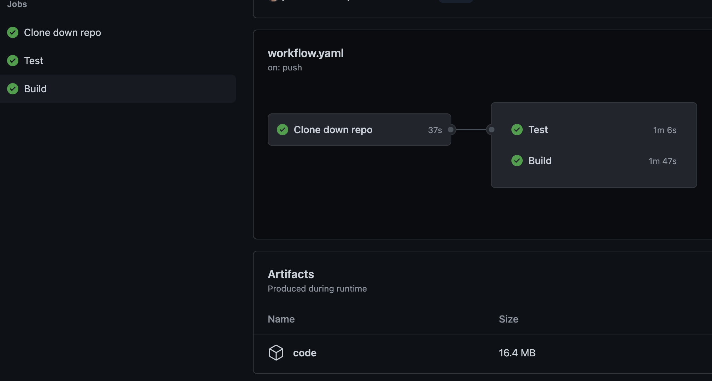

## Workflow

When you have larger or more complex projects, you’ll want separate jobs to do separate things (i.e. build or test).
We will split the steps we have so far have created in single job to each their own distinct job.

Up until now, we have had a job called `build` both for the build and test, but that is not necessarily descriptive.
The only reason we have done this, is because Github Actions **requires** you to have one job called `build`

We define each job as a collection of `jobs` key:

```YAML
jobs:
  my_first_job:
    name: My first job
  my_second_job:
    name: My second job
```

We want to be able to control the order that our jobs are executed.
This is accomplished with the `needs` key of a job.
A job can declare that it `needs` one or more (a list) of jobs to finish successfully before it is triggered.

To run the two jobs sequentially we define a workflow where job-2 "requires" job-1 to have run before it starts.

```YAML
name: workflow
jobs:
  job-1:
  job-2:
    needs: job-1
```

This also ensures that `job-2 ` is not run if `job-1 ` fails. It is possible to add name to workflow fx. here: `name: workflow`.

To ensure that all files from previous jobs are available at new one, we have to make sure to upload artifact at the end of the job and download it at the beginning of a new one.
The way to do it can be found in previous exercise `04-storing-artifacts.md`.

### Tasks

Let's try to clean up our current build by utilizing workflows:

1. Name your workflow `Java CI`.
2. Divide your job into three jobs: `Clone-down`, `Test` and `Build`. `Clone-down` will checkout the repository, `Test` job runs the tests for code, `Build` will build the code and stores the results.
3. `Test` and `Build` should be dependent on `Clone-down` job. Each of them also needs a running instance and container.

Remember that to have information from previous job(s) the artifact with this information needs to be downloaded and respectively uploaded.

Opening it should show something like:



More information about this topic can be found here: https://docs.github.com/en/actions/reference/workflow-syntax-for-github-actions

## Resources

https://github.com/marketplace/actions/upload-a-build-artifact
https://github.com/marketplace/actions/download-a-build-artifact
